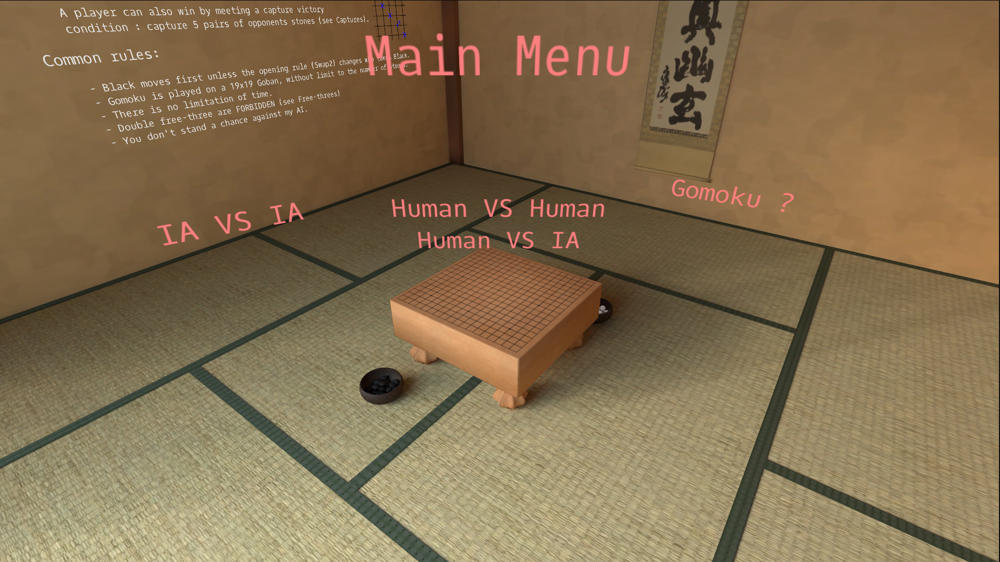
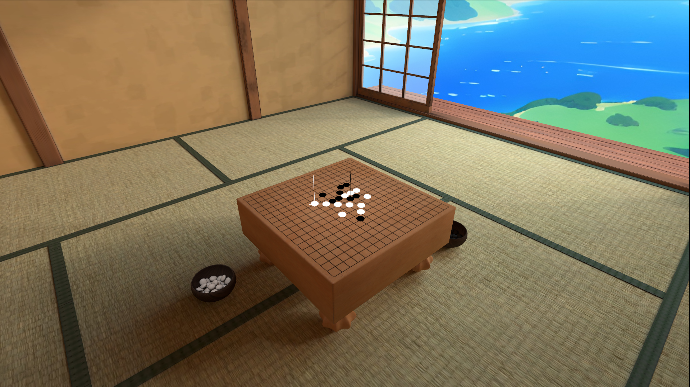
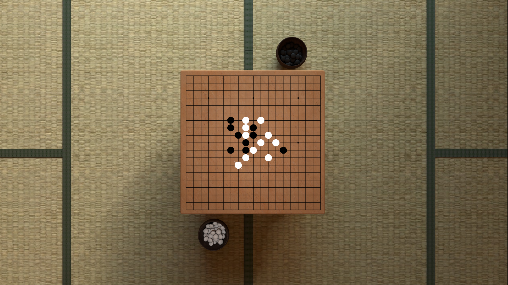
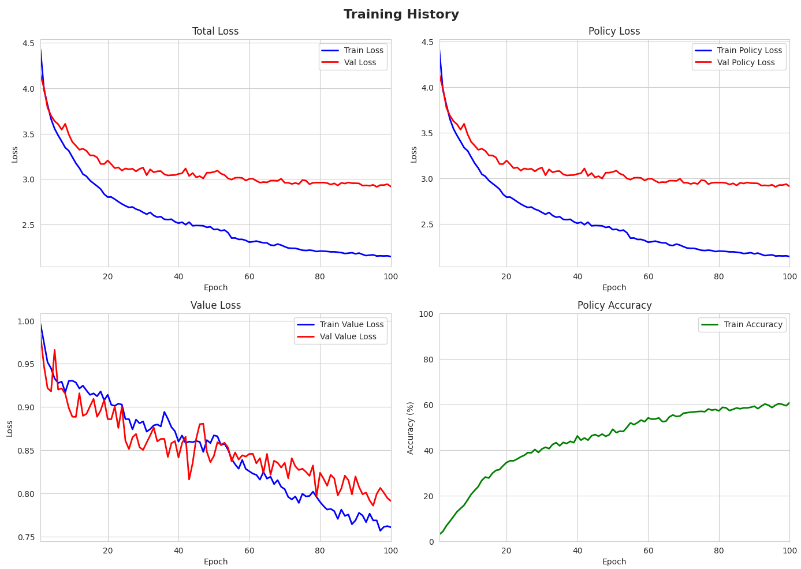
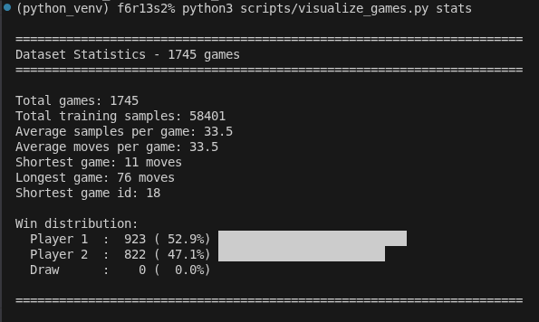
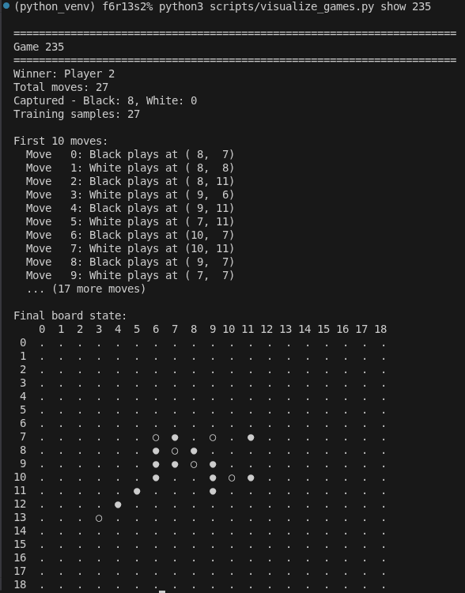

# Gomoku (in progress..)
Creation of a Gomoku like game with 3D OpenGl visuals with the implementation of an 'AlphaGo' like AI bot.

Build with an mcts, with auto-generated games and my own Convolutional Neural Network

## Binary Format from save_game_data:

### Header:
```
int num_samples (4 bytes)
int winner (4 bytes)
```

### For each sample:
```
unsigned int board[19][19] (361 × 4 = 1444 bytes)
float policy[19][19] (361 × 4 = 1444 bytes)
float value (4 bytes)
int current_player (4 bytes)
unsigned int captured_black (4 bytes)
unsigned int captured_white (4 bytes)
int move_number (4 bytes)
```

## Screenshots







## First CNN raw training (not implemented with MCTS yet)  


## Statistics of all my generated games (we can notice the 3% more winrate for the first player)  


## Detail of the game #235  


## Feature Extraction Protocol

```
            INPUT: (batch, 7, 19, 19)
                     │
                     ▼
┌─────────────────────────────────────────────────┐
│             SHARED BACKBONE (feature extraction)│
│                                                 │
│  ┌─────────────────────────────────────────┐    │
│  │ Input Conv Block                        │    │
│  │   Conv2d(7 → 128, 3x3)                  │    │
│  │   BatchNorm2d(128)                      │    │
│  │   ReLU                                  │    │
│  └─────────────────────────────────────────┘    │
│                    │                            │
│                    ▼                            │
│  ┌─────────────────────────────────────────┐    │
│  │ Residual Block 1                        │    │
│  │   Conv2d(128 → 128) + BN + ReLU         │    │
│  │   Conv2d(128 → 128) + BN                │    │
│  │   + skip connection + ReLU              │    │
│  └─────────────────────────────────────────┘    │
│                    │                            │
│                    ▼                            │
│  ┌─────────────────────────────────────────┐    │
│  │ Residual Blocks 2-6 (same structure)    │    │
│  └─────────────────────────────────────────┘    │
│                    │                            │
│         Output: (batch, 128, 19, 19)            │
└────────────────────┬────────────────────────────┘
                     │
         ┌───────────┴───────────┐
         ▼                       ▼
┌─────────────────┐    ┌─────────────────┐
│   POLICY HEAD   │    │   VALUE HEAD    │
│                 │    │                 │
│ Conv2d(128→32)  │    │ Conv2d(128→1)   │
│ BatchNorm(32)   │    │ BatchNorm(1)    │
│ ReLU            │    │ ReLU            │
│ Flatten         │    │ Flatten         │
│ FC(11552→361)   │    │ FC(361→128)     │
│                 │    │ ReLU            │
│                 │    │ FC(128→1)       │
│                 │    │ Tanh            │
│       ▼         │    │       ▼         │
│  (batch, 361)   │    │  (batch, 1)     │
│  Move logits    │    │  Win prob       │
└─────────────────┘    └─────────────────┘
```